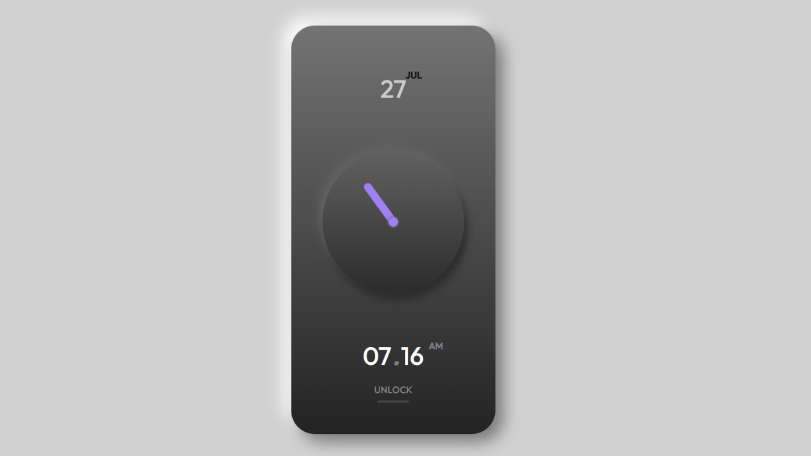

# 🕒 Neumorphic Clock UI

A beautiful, minimal **Neumorphic Clock** built with **HTML**, **CSS**, and **JavaScript**. This project combines both analog and digital elements with a soft UI aesthetic, inspired by the modern **neumorphism design trend**.



---

## 🚀 Features

- ✅ Real-time digital clock (hours, minutes, AM/PM)
- ✅ Animated analog clock hand (seconds-based rotation)
- ✅ Dynamic date display (day + month)
- ✅ Soft shadows & glowing elements (pure CSS)
- ✅ Clean, modern layout perfect for UI inspiration

---

## 🛠️ Tech Stack

- **HTML5** – semantic structure  
- **CSS3** – neumorphic styling with gradients and shadows  
- **JavaScript (ES6)** – dynamic time updates and animation  

---

## 📁 Folder Structure

```
neumorphic-clock/
├── index.html
├── style.css
├── script.js
├── thumbnail.png
└── README.md
```

---

## ✨ Getting Started

1. **Clone the repository:**

   ```bash
   git clone https://github.com/yourusername/neumorphic-clock.git
   cd neumorphic-clock
   ```

2. **Open `index.html`** in your browser  
   Or use **Live Server** in VS Code for real-time preview.

---

## 🧠 Learning Purpose

This project is perfect for:

- Practicing real-world DOM manipulation
- Understanding time/date formatting with `Date()`
- Improving UI/UX design skills with Neumorphism
- Portfolio or personal UI experiments

---

## 🧪 Customization Ideas

- Add alarm functionality
- Sync with world timezones
- Make it a widget for your website
- Add light/dark mode toggle

---

## 🙌 Author

**Aziz Chniti**  
[Youtube](https://www.youtube.com/@Barmajli) • [LinkedIn](www.linkedin.com/in/azizchniti)

---

## 📢 Feedback & Support

Found a bug or want to suggest a feature?  
Feel free to open an issue or fork the project to make it your own!
